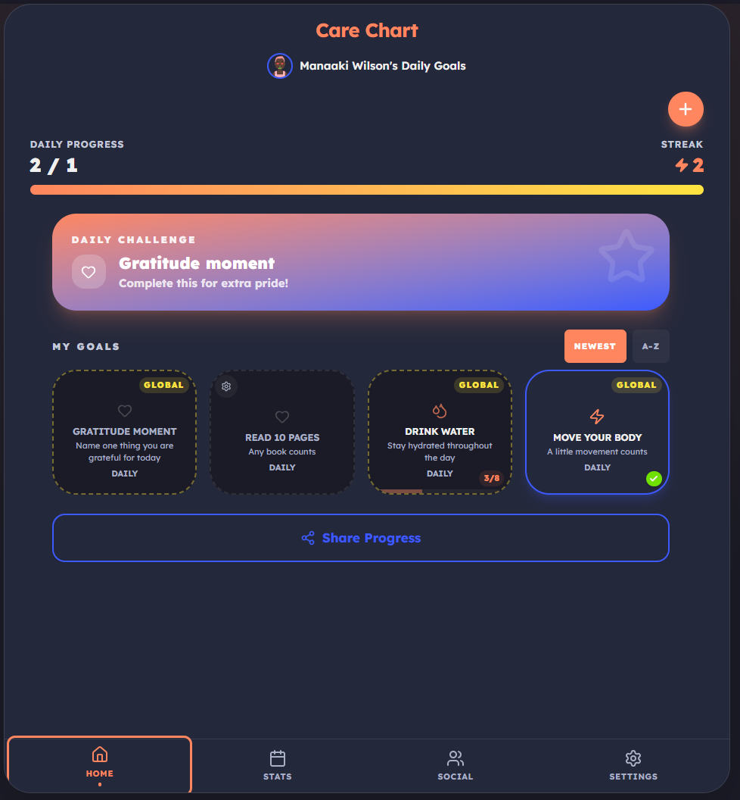

# CareStickers Application

> [!IMPORTANT]
> **In development** — CareStickers is still in active development. Features, APIs, and hosting may change before a stable release.


[](https://github.com/Jono120/brat-tamer/actions/workflows/supabase.yml)
[](https://github.com/Jono120/brat-tamer/actions/workflows/ci.yml)

Welcome to CareStickers, this is a social self-care tracking app: set personal and community goals, earn stickers, share progress with friends, and stay motivated together. You can be part of a team or a team admin for your friends or family.


> We will protect your privacy with the application storage and never share any details to third parties or internally unless you are providing bug information.


<p align="center">
  
</p>

## Features

- **Personal & global goals** — self-care tasks plus community-wide global goals
- **Daily challenges** — admin-promoted goals for all users
- **Stickers** — visual rewards for completed goals
- **Social** — invites, high-fives, and shared progress
- **Groups** — join via invite codes; creators get a Group Admin role
- **Admin portal** — manage community goals, track progress, search users
- **Multi-auth** — email/password, magic link, Google, and Apple (Supabase Auth)
- **Onboarding** — interactive tutorial for new users

## Quick start

**Prerequisites:** Node.js 20+, a [Supabase](https://supabase.com) project (or local Postgres via Docker).

```bash
npm install
cp .env.example .env # configure API + Vite vars
npx supabase login
npx supabase link --project-ref <SUPABASE_PROJECT_ID>
npm run db:push
npm run dev # SPA :3000, API :3001
```

Production: `npm run build` then `npm start`. See [docs/DEVELOPMENT.md](docs/DEVELOPMENT.md) for env vars, scripts, and testing.

## Documentation

| Doc | Contents |
| --- | --- |
| [docs/ARCHITECTURE.md](docs/ARCHITECTURE.md) | Stack, component diagram, project layout, routing |
| [docs/DEVELOPMENT.md](docs/DEVELOPMENT.md) | Configuration, npm scripts, testing |
| [docs/DEPLOYMENT.md](docs/DEPLOYMENT.md) | Production, Docker, GHCR |
| [docs/SUPABASE.md](docs/SUPABASE.md) | Linking, auth providers, local stack, migrations CI |
| [docs/MOBILE_RELEASE.md](docs/MOBILE_RELEASE.md) | Capacitor builds, OAuth, push, store submission |
| [docs/AWS_DEPLOYMENT_PLAN.md](docs/AWS_DEPLOYMENT_PLAN.md) | Proposed AWS test environment (not provisioned) |

## Stack (summary)

React 19 · Vite · Tailwind · Express · Supabase (Postgres, Auth, Realtime, Storage) · Capacitor for iOS/Android. One container image serves the API and static SPA.

## Security

Identities and sessions are managed by **Supabase Auth**; the API verifies JWTs (JWKS) and enforces access server-side. Keep `SUPABASE_SECRET_KEY`, database credentials, and provider secrets in `.env` only — never in the repo or client bundle. See [docs/SUPABASE.md S8](docs/SUPABASE.md#8-security-notes).

## Licence

See SPDX headers in source files where applicable (e.g. `App.tsx`).
