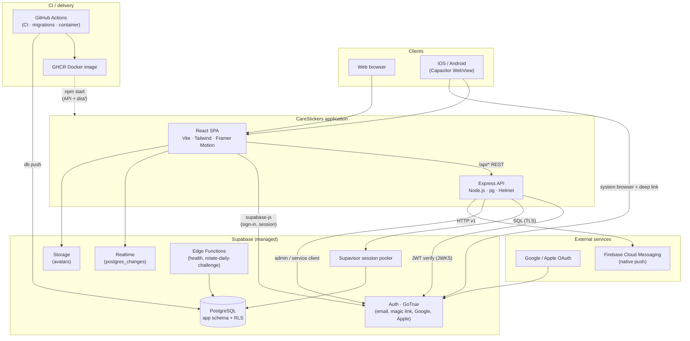

# Architecture

CareStickers is a single deployable unit — an Express API plus a Vite-built React SPA — that uses
Supabase for identity, PostgreSQL, realtime updates, and file storage. Native apps ship the same
React bundle inside a Capacitor WebView.

## Technical stack

| Layer | Technologies |
| --- | --- |
| **Frontend** | React 19, TypeScript, Vite, Tailwind CSS, Framer Motion (`motion/react`), Lucide React |
| **Backend** | Node.js, Express, `pg` pool against Supabase Postgres |
| **Auth** | Supabase Auth (GoTrue) — email/password, magic link, Google, Apple. Browser: `@supabase/supabase-js`; API: `@supabase/server` (JWKS + RLS-scoped clients); Edge Functions: `withSupabase` |
| **Native** | [Capacitor](https://capacitorjs.com/) (`ios/`, `android/`) for App Store and Google Play |
| **Delivery** | Docker image (Node 24), GitHub Actions (CI, migrations, GHCR) |

## Component map

| Component | Role |
| --- | --- |
| **React SPA** (`src/`) | UI, routing, local state; calls `/api` and Supabase directly where RLS allows (auth, realtime, avatars). |
| **Express API** (`server/`) | Authoritative business logic, admin routes, push registration/sending; verifies Supabase JWTs. |
| **Supabase Auth** | User identities, sessions, OAuth providers; issues JWTs consumed by the SPA and API. |
| **PostgreSQL** | Goals, stickers, groups, interactions, push tokens; schema in `supabase/migrations/`. |
| **Supabase Realtime** | Live updates for interactions, sticker logs, and group membership (`src/lib/realtimeSync.ts`). |
| **Supabase Storage** | User avatar uploads (public bucket; URLs resolved server-side in `server/src/avatarUrl.ts`). |
| **Edge Functions** | Scheduled/ops tasks (e.g. daily-challenge rotation) deployed separately from the main container. |
| **Capacitor** | Native shell, OAuth browser flow, FCM/APNs token registration (`src/lib/native.ts`, `nativePush.ts`). |
| **FCM** | Delivers push notifications when friends interact (`server/src/push.ts`). |
| **GitHub Actions** | Typecheck/tests (CI), migration deploy (Supabase workflow), production image build (Container → GHCR). |
| **Docker** | Single image: built SPA in `dist/` plus Node API (`Dockerfile`, `docker-compose.yml` for local Postgres). |

## Project layout

| Area | Location |
| --- | --- |
| React UI & state | `src/App.tsx`, `src/components/` |
| Supabase browser client | `src/lib/supabaseClient.ts` |
| API client (session token) | `src/api/client.ts`, `src/api/careApi.ts` |
| Shared types | `src/types.ts`, generated `src/types/database.ts` |
| HTTP API & routes | `server/src/index.ts` |
| `@supabase/server` (Express) | `server/src/supabaseServer.ts` |
| Edge Functions | `supabase/functions/` |
| Database schema (canonical) | `supabase/migrations/` (`0001` tables, `0002` auth link, `0003` Storage, `0005` RLS/Realtime, `0006` hardening, `0007` push tokens, …) |
| DB pool, SSL & optional auto-migrate | `server/src/db.ts` |
| Supabase CLI config & seed | `supabase/config.toml`, `supabase/seed.sql` |
| Capacitor config | `capacitor.config.ts` |
| Native projects | `android/`, `ios/` (generated; see [MOBILE_RELEASE.md](MOBILE_RELEASE.md)) |

## Request routing

**Development** — Vite serves the SPA on port 3000 and proxies `/api/*` to Express on port 3001.

**Production (web)** — Host the API and static `dist/` on the **same HTTPS origin** so the client
uses relative `/api` paths and CORS stays simple.

**Production (mobile)** — Capacitor WebViews are **not** same-origin with your server. Build with
`VITE_API_BASE` set to your public API URL (no trailing slash). See
[MOBILE_RELEASE.md](MOBILE_RELEASE.md).

## Related docs

- [SUPABASE.md](SUPABASE.md) — linking, auth providers, local stack, CI, security
- [DEVELOPMENT.md](DEVELOPMENT.md) — local setup, env vars, scripts, testing
- [DEPLOYMENT.md](DEPLOYMENT.md) — production, Docker, GHCR
- [MOBILE_RELEASE.md](MOBILE_RELEASE.md) — iOS/Android store release runbook
- [AWS_DEPLOYMENT_PLAN.md](AWS_DEPLOYMENT_PLAN.md) — proposed AWS test environment
