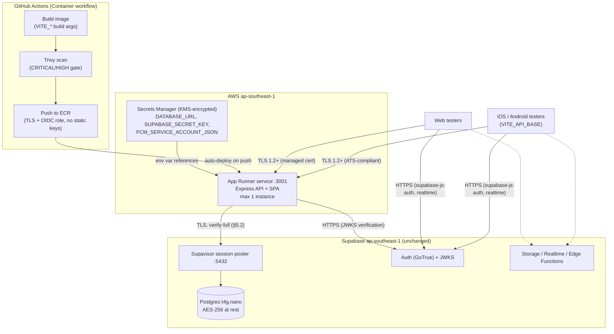

# AWS Deployment Plan — Test Environment

Plan for hosting the CareStickers application container on AWS, co-located with the existing Supabase project (`ap-southeast-1`, Singapore), with encryption enforced on every hop between environments. The Supabase database, auth, storage, and realtime stack stay exactly as they are — no schema or platform changes.

**Status: proposal — nothing in this document has been provisioned yet.**

## 1. Objective

Provide a usable, secure test environment for web and Capacitor (iOS/Android) testers:

- Application container (Express API + static SPA) runs in the **same AWS region** as the Supabase database, keeping API-to-database round trips on the AWS backbone.
- Public **HTTPS endpoint on a trusted certificate** (required by iOS ATS and the OAuth deep-link flow).
- **No secrets** in the repository, image, or GitHub repository variables — runtime secrets live in AWS Secrets Manager.
- **Encryption in transit on every hop** and at rest in every store (see §5).
- Cost proportional to a test workload (single-digit USD per month at idle).

## 2. Target architecture

| Piece | Choice | Why |
| --- | --- | --- |
| Region | `ap-southeast-1` (Singapore) | Matches the Supabase project; ~1 ms to the Supavisor pooler |
| Compute | AWS App Runner, 0.25 vCPU / 0.5 GB, **max 1 instance** | Managed TLS, Secrets Manager integration, memory-only billing at idle; instance cap protects the t4g.nano database (§4.2) |
| Image registry | Amazon ECR (private) | App Runner cannot pull from GHCR; auto-deploy on push |
| Secrets | AWS Secrets Manager | KMS-encrypted, injected into App Runner as env vars, rotation without rebuild |
| CI/CD | Existing Container workflow + ECR push | Trivy gate retained; GitHub OIDC role, no long-lived AWS keys |
| Database / Auth / Storage / Realtime | Supabase (unchanged) | Already AWS-hosted in the same region |

## 3. Phased rollout

### Phase 1 — AWS foundation (console / IaC, one-time)

1. **ECR repository** `carestickers` in `ap-southeast-1`, private, **AES-256/KMS encryption enabled**, tag immutability on, scan-on-push on (belt-and-braces with Trivy).
2. **Secrets Manager** secrets (default KMS key is fine for testing): - `carestickers/staging/DATABASE_URL` — Supavisor **session pooler** URL (`...@aws-0-ap-southeast-1.pooler.supabase.com:5432/postgres`) - `carestickers/staging/SUPABASE_SECRET_KEY` - `carestickers/staging/FCM_SERVICE_ACCOUNT_JSON` (when push testing starts)
3. **IAM**: - **GitHub OIDC role** trusted by this repository, permissions limited to ECR push on the one repo. No AWS access keys stored in GitHub. - **App Runner ECR access role** (pull from the repo). - **App Runner instance role** with `secretsmanager:GetSecretValue` on the three secrets only.

### Phase 2 — Pipeline changes (`.github/workflows/deploy.yml`)

1. Add `id-token: write` permission and `aws-actions/configure-aws-credentials` (OIDC role from Phase 1).
2. Add ECR login (`aws-actions/amazon-ecr-login`) and tag/push the image to ECR after the existing Trivy gate passes. GHCR push can be kept or dropped; ECR becomes the deploy source.
3. App Runner **auto-deploy** is enabled on the service (Phase 4), so an ECR push *is* the deployment — no extra deploy step needed.

### Phase 3 — Application changes (small, code)

1. **`server/src/db.ts` — pool sizing.** Replace the hardcoded `max: 20` with an env-driven value defaulting to **5** (`PGPOOL_MAX`). Rationale: the session pooler maps each active client connection to a real Postgres backend for the session's lifetime, and the Nano compute tier defaults to ~15 backend connections — a single instance at `max: 20` can exhaust it alone.
2. **`server/src/db.ts` — TLS verification.** Currently `ssl: { rejectUnauthorized: false }`, which encrypts but does **not authenticate** the server — a machine-in-the-middle with any certificate would be accepted. Fix: download the project CA certificate from the Supabase dashboard (Settings → Database → SSL configuration), ship it via a `PGSSL_CA` env var (or bundled file path), and set `ssl: { rejectUnauthorized: true, ca }`. Keep `PGSSL=disable` for local Docker and fall back to the current relaxed mode only when no CA is provided, so local workflows are unaffected.
3. **`.env.example`** — document `PGPOOL_MAX` and `PGSSL_CA`.

### Phase 4 — App Runner service

1. Create service from the ECR image, `ap-southeast-1`: - Port `3001`; health check path `/api/health` (already implemented — it pings the database, so it also validates the pooler connection and TLS config). - Instance size 0.25 vCPU / 0.5 GB; autoscaling **min 1 / max 1**. - Auto-deploy on new image push: enabled.
2. Plain env vars: `SUPABASE_URL`, `SUPABASE_PUBLISHABLE_KEY`, `FRONTEND_URL` (the App Runner URL itself, for same-origin CORS), `ADMIN_EMAILS`, `NODE_ENV`.
3. Secret references (from the instance role): `DATABASE_URL`, `SUPABASE_SECRET_KEY`, `FCM_SERVICE_ACCOUNT_JSON`.
4. The default `https://<id>.ap-southeast-1.awsapprunner.com` domain has a managed TLS certificate — sufficient for testing. A custom domain via ACM can come later.

### Phase 5 — Supabase staging hardening (dashboard)

1. Use a **dedicated staging Supabase project** — do not point testers at production. Apply migrations with `npm run db:push` against it.
2. **Auth → restrict signups**: disable public signups or use an invite/allow-list; keep `ADMIN_EMAILS` / `VITE_ADMIN_EMAILS` to real test admins. Auth is the front door, so this is the primary access control for the whole environment.
3. **Redirect allow-list**: add the App Runner URL and `com.carestickers.app://auth-callback` (mobile deep link).
4. **Database network restrictions** (Settings → Database): optional for testing. Note App Runner egress IPs are dynamic; pinning requires a VPC connector + NAT with an Elastic IP (~US$35/month) — not worth it for a test environment, revisit for production.

### Phase 6 — Verification

1. CI run: image builds, Trivy passes, ECR receives the tag, App Runner deploys.
2. `GET /api/health` returns OK over HTTPS (confirms DB TLS verify-full works).
3. Web flow: sign-in (email + OAuth), CORS clean on the same origin.
4. Mobile: staging Capacitor build (`npm run build:cap:staging`) with `VITE_API_BASE=https://<apprunner-url>`; OAuth deep-link round trip on device.
5. Confirm only 1 instance and ≤ `PGPOOL_MAX` connections visible in the Supabase dashboard under load.

## 4. Encryption between environments

"End-to-end" here means **every hop is TLS-encrypted and every store is encrypted at rest, with server identity verified on each hop**. (True client-side E2EE — where the server cannot read user data — is a different, application-level undertaking; see
§4.4.)

### 4.1 In transit — hop by hop

| Hop | Protocol | Certificate / verification |
| --- | --- | --- |
| Browser / Capacitor app → App Runner | TLS 1.2+ | AWS-managed certificate (ATS-compliant for iOS) |
| Browser / app → Supabase (Auth, Realtime, Storage) | TLS 1.2+ | Supabase's public certs, verified by the OS/browser |
| App Runner → Supavisor pooler (Postgres) | TLS | **Currently unverified — fixed in Phase 3.2** with the Supabase CA and `rejectUnauthorized: true` (equivalent of `verify-full`) |
| App Runner → Supabase Auth (JWKS fetch, admin API) | HTTPS | Standard CA verification inside `@supabase/server` / `fetch` |
| App Runner → FCM (push) | HTTPS | Google-managed certs; service-account JWT auth |
| GitHub Actions → ECR | HTTPS | SigV4-signed, OIDC short-lived credentials |

The Phase 3.2 fix is the single most important item in this section: everything else already verifies server identity; the database hop currently only encrypts.

### 4.2 At rest

| Store | Encryption |
| --- | --- |
| Supabase Postgres + backups | AES-256 at rest (provider-managed, already active) |
| Supabase Storage (avatars) | AES-256 at rest (provider-managed) |
| AWS Secrets Manager | KMS envelope encryption |
| Amazon ECR images | AES-256 / KMS (enable at repo creation, Phase 1.1) |
| App Runner logs (CloudWatch) | Encrypted at rest by default; avoid logging tokens or PII |

### 4.3 Keys and tokens

- User sessions are Supabase-issued JWTs, verified server-side against the project **JWKS** (asymmetric — the API holds no signing secret).
- `SUPABASE_SECRET_KEY` exists only in Secrets Manager and the App Runner process environment; it is never in the image, repo, or client bundle.
- `VITE_*` values compiled into the client are public by design (anon key, URLs).
- Rotation: rotate a secret in Secrets Manager, then redeploy/restart the App Runner service — no image rebuild required.

### 4.4 Optional later phase: application-level encryption for sensitive fields

If specific user content (e.g. journal-style goal notes) is deemed sensitive enough that even database-level access should not reveal it, add **column-level encryption**: the API encrypts values with AES-256-GCM using a data key from AWS KMS (or Supabase Vault) before insert, and decrypts on read. Trade-offs: encrypted columns cannot be searched/filtered in SQL, RLS still applies only to row access, and key loss means data loss. Not recommended for the test phase — listed so the decision is conscious rather than overlooked.

## 5. Cost estimate (test workload, USD/month)

| Item | Estimate |
| --- | --- |
| App Runner (0.5 GB provisioned, light active use) | ~$3–7 |
| ECR storage (a few image versions) | <$1 |
| Secrets Manager (3 secrets) | ~$1.20 |
| Data transfer (test volumes) | <$1 |
| Supabase | unchanged (existing plan) |
| **Total additional** | **~$5–10/month** |

Pausing the App Runner service between test cycles drops compute cost to zero.

## 6. Out of scope (deliberately)

- Custom domain + ACM certificate (App Runner default domain is fine for testers).
- Static egress IP / VPC connector (see Phase 5.4).
- WAF, multi-instance scaling, blue-green deploys — production concerns.
- Any change to the Supabase platform, schema, or migrations.
